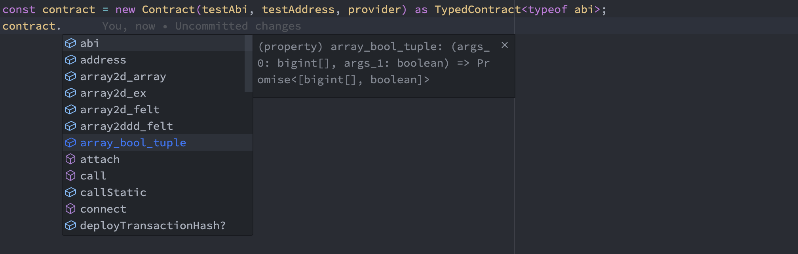
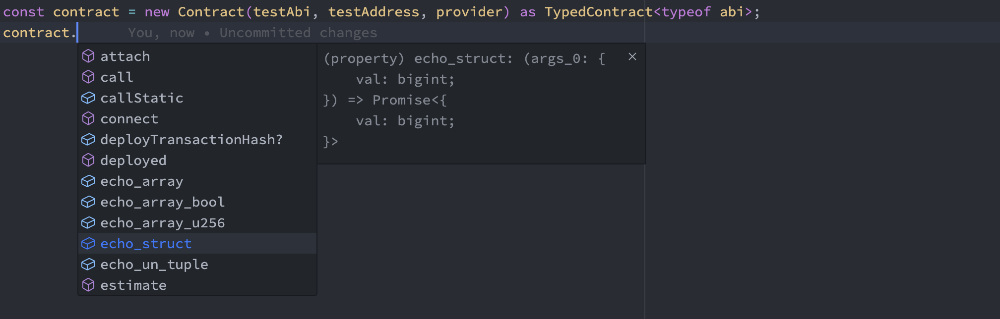
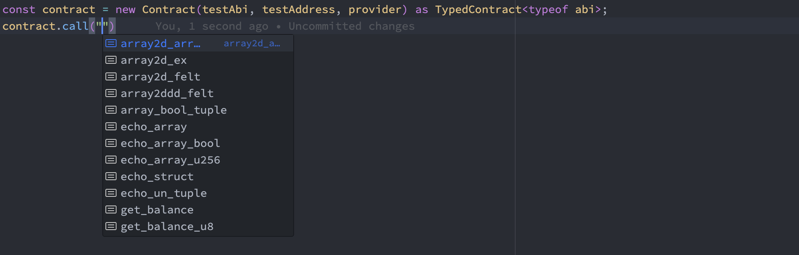
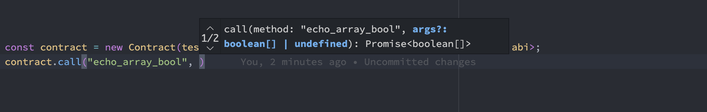

# abiwan-demo

How to use [abiwan](https://github.com/keep-starknet-strange/abi-wan-kanabi) for typechecking and autocompleting [starknet.js](https://github.com/0xs34n/starknet.js/) contract calls

# Usage

You only need to cast the starknet.js `Contract` to a `TypedContract<typeof abi>` and typechecking is on for all your contract function calls wether you're using the `call` method or calling the functions by their name

You can find a working example in the file [`example.ts`](./example.ts), you can run it with `npm run example` after installing the dependencies with `npm install`

### Usage Example

```typescript
import { Provider, Contract, constants } from "starknet";
import { Abi, TypedContract as AbiWanTypedContract } from "abi-wan-kanabi";

type TypedContract<TAbi extends Abi> = AbiWanTypedContract<TAbi> & Contract;

const provider = new Provider({
  sequencer: { network: constants.NetworkName.SN_GOERLI2 },
});

// It should be a const for Typescript to narrow the types
const abi = [
  // YOUR ABI HERE
] as const;

const testAddress =
  "0x01c6b2a993b335cabc12dd5fa39875f456f07f23b10dcbdf6529667a322bbda4";
const { abi: testAbi } = await provider.getClassAt(testAddress);
if (testAbi === undefined) {
  throw new Error("No ABI.");
}

const contract = new Contract(testAbi, testAddress, provider) as TypedContract<typeof abi>

// If you hover over the function in VSCode, you'll see the correct signature inferred
await contract.call("get_balance");
//             ^
//             |
//             (method) call<"get_balance">(method: "get_balance", args?: [] | undefined): Promise<bigint> (+1 overload)

await contract.get_balance();
//             ^
//             |
//             (property) get_balance: () => Promise<bigint>
```

## Screenshots

### Contract functions have the correct signature



### Even if the inputs/outputs are structs



### Autocompletion for `call`: ABI function names



### Autocompletion for `call`: selected function signature



## Demo Video

[`assets/demo.mov`](./assets/demo.mov)


# Enjoy !
